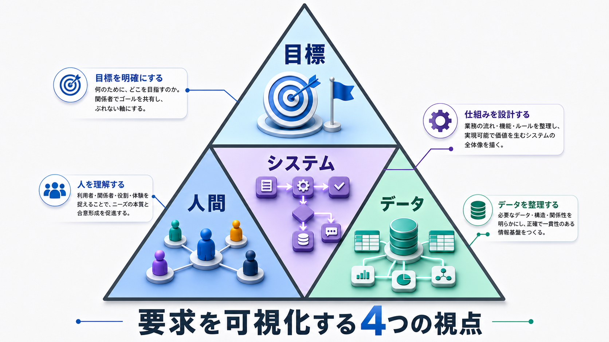

# 要求（4つの視点）— 所属長の残業時間管理（月間だけ）— たたき台

> 2026-09-13 のたたき台。`REQUEST.md` に追加する前の箇条書き。
> 根拠は `TESTDATA_LOG.md` 2026-09-13（岡田 30:45／白石 45:45 を入れて勤怠モニターで実測）と `fig_clock_flow_tall.png`。
> **範囲：残業時間の上限チェックは 月間・複数月（2〜6ヶ月の平均）・年間 の3種類あるが、今回は月間だけ。**

頂点＝**目標**（何のために）、中央＝**システム**（どこに線を引くか）、左下＝**人間**（誰のために）、右下＝**データ**（何を記録するか）。

---

## 【目標】何のために作るのか

**所属長が、部下の残業が月45時間を超える前に気づいて、仕事を減らせる状態にする。**

- いま freee は、残業時間を集計している。36協定のアラートも出す。だが、
  - 出るのは**超えたあと**（実績が閾値を超えた瞬間にアイコン）
  - 出る場所は**給与担当が締めのときに開く画面**（勤怠モニター・支払月で並ぶ）
  - **誰にも通知されない**（ヘルプ明記）
- 違反で罰せられるのは会社と所属長。**締めのあとに分かっても手遅れ。**
- 目指すのは、所属長が**毎朝**、部下ごとの「残り時間」と「いまのペースで超える日」を見て、その日のうちに手を打てること。

**測定方法**
- 月45時間を超えた人数（目標：0人。ただし「超えそうだったのに超えなかった」が見えること）
- 閾値の80%（36時間）に達してから、所属長がそれを知るまでの時間（目標：翌朝まで）
- ★**「残業時間の合計」は目標にしない。** 減らすこと自体が目的ではない。超えないことが目的

**今回は対象外**
- 複数月平均（80時間）と年間（360時間・720時間）の追跡はしない。**今回は月間だけ**
- 36協定そのもの（限度時間・特別条項・届出日・労働者代表）の管理はしない。閾値は設定値として持つだけ
- 残業の事前申請・承認はしない（freee の承認経路を使う。ただし未設定）
- 給与計算はしない。freee がやる
- 打刻の入力画面は作らない。freee がやる

---

## 【人間】誰のために作るのか

**所属長（部長15名・本部長3名）。自分の部下だけを、毎朝1分で見る。**

- **見る人＝手を打つ人。** 入力はしない。打刻は部下が freee でする
- 所属長は労務の専門家ではない。「45時間」が何かは知っているが、「複数月平均」「特別条項」は知らなくてよい
- 部下は数名〜十数名。全社36人を見る画面は要らない
- **部下は、毎日必ず打刻する。遅くとも翌朝一番までに。** 打刻が無い日は残業の数字にならない（みなしになる）ので、
  数字の信用は部下の打刻にかかっている。**忘れた場合は、所属長が本人に注意する**（システムは「打刻なし」を見せるだけ）
- **兼務がある。** 相川（人事部長・労務部課長を兼務）、藤沢（経理部長・本部長を兼務）。
  **兼務者は、主務のある所属の所属長が見る**（決定）
- **課長の勤怠は部長が見る。部長の勤怠は部長自身が見る**（決定）。本部長・役員は今回の範囲外
- 労務担当（労務部）は全社を見たいが、それは今回の主役ではない。**主役は所属長**

このことが効く点:
- **一覧は「自分の部下」だけ。** ログインした人の所属から絞る（`employee_group_memberships`）
- **数字は3つで足りる。** 今月の実績・残り・超える予定日。内訳（深夜・休日）は開けば見える程度
- **承認フローは作らない。** 気づいたあとの「仕事を減らす」は業務であって、システムの外
- **今回は画面だけ。** 所属長が毎朝開く。「見なくても届く」通知は次の段階（決定）

---

## 【システム】どこに線を引くか

**freee から読む。外に器を作る。freee へは書かない。**

| | どこにあるか | どうするか |
|---|---|---|
| 打刻・日次勤怠（時間外・深夜・休日の内訳つき） | freee人事労務 `work_records/{date}` | **読む。作らない** |
| 月次集計 | freee人事労務 `work_record_summaries` | **読む。ただし当月は日次から自分で積む**（サマリは締めのあとの数字） |
| 誰がどの部署か・役職・兼務 | freee人事労務 `employee_group_memberships` | **読む。作らない** |
| 36協定アラートの閾値（30h／45h） | freee人事労務 勤怠モニター「36協定設定」 | **読めない（APIに無い）。こちらで設定値として持つ** |
| 36協定アラート（実績・予測） | freee人事労務 勤怠モニター | **使わない。** 支払月・事後・通知なし |
| 残業申請の事前承認 | freee人事労務 `approval_requests/overtime_works` | **今回は使わない**（承認経路が未設定） |
| **部下ごとの残り時間と、超える予定日** | **どこにも無い** | **★ここを作る** |
| **超える前に届く通知** | **どこにも無い** | **今回は作らない。画面で見る**（次の段階） |

### ★線を引く理由

**freee が持っているのは「締めのあとの数字」で、欲しいのは「締めの前の数字」だから。**

- 勤怠モニターは給与の座標系（支払月）で並ぶ。9月の残業は「10月」の札の下にある
- 実績アラートは超えてから出る。予測列はあるが、アイコンだけで誰にも届かない
- 当月の判定は日次しか見ない（サマリで入れた8月は集計には出るが判定に掛からなかった）

**同じ「時間外労働」の数字を、給与は確定してから、36協定は確定する前に使いたい。** 道具が違う。

### 線の内側（作る）

- 前日までの日次勤怠を、部下の人数ぶん freee から読む（毎朝）
- **勤務月**で積む（支払月ではなく）
- 残り時間 ＝ 閾値 − 今月の実績
- いまのペース（実績 ÷ 経過営業日 × 残り営業日）で、超える予定日を出す
- **みなしの数字（打刻なしで480分）は残業の集計から除く。** 代わりに「打刻なし日数」を出す
- 80%到達／閾値超過を、画面上の状態（安全／注意／警告）として出す。通知は今回作らない
- 読めたか／読めなかったかを記録する（毎朝の数字が古いまま出るのを防ぐ）

### 線の外側（作らない）

- 打刻（freee の画面・アプリ）
- 残業の事前申請と承認（freee の承認経路）
- 給与計算・勤怠の締め（freee）
- 36協定の書面・届出

---

## 【データ】何を記録するか

**概念データモデル**（テーブル名や桁数は、この段階では決めない）

**リソース（持っているもの）**
- **従業員** … freee から読む（36人。役員2人は勤怠管理なしで対象外）
- **所属** … 誰がどの部署か・主務か兼務か・役職。freee から読む
- **所属長** … 部署ごとに誰が見るか。freee の「役職＝部長」から導くが、**兼務の扱いはこちらで決める**
- **閾値** … 要注意30h／警告45h／注意する割合80%。**こちらで持つ。freee の36協定設定と二重に持つことを許す**（決定。読めないので手で揃える）
- **営業日カレンダー** … 所定休日・祝日。freee の `day_pattern` から読む

**イベント（起きたこと）**
- **日次勤怠** … いつ・誰が・時間外・深夜・休日、打刻ありか／みなしか。freee から読む
- **状態の変化** … いつ・誰が・どの状態に入ったか（注意／警告）。**作る**（通知は今回作らないが、記録は残す）
- **取得の記録** … 毎朝、何人ぶん読めたか・読めなかったか。**作る**

**断面（ある時点の姿）**
- **部下ごとの今月の残業** … 実績・残り・ペース・超える予定日・状態（安全／注意／警告）・打刻なし日数
- **所属長ごとの一覧** … 上の断面を、その人の部下だけに絞ったもの

---

### ★決めなければ作れないこと

1. ~~**兼務者の部下は、誰が見るか。**~~ **→ 決定：主務のある所属の所属長が見る。**
   相川（主務＝人事部長、兼務＝労務部課長）の残業は、労務部長の三浦の一覧には出ない。主務が部長なので 2 により自分で見る。
   藤沢（主務＝経理部長、兼務＝本部長）も同じ。

2. ~~**所属長自身の残業は、誰が見るか。**~~ **→ 決定：課長の勤怠は部長が見る。部長の勤怠は部長自身が見る。**
   部長15名も固定時間制で残業が付く。本部長・労務部が部長を見る仕組みは今回作らない。

3. **「超える予定日」の計算をどうするか。**（未決）
   「超える予定日」＝いまのペースで残業を続けたら、**月の何日に45時間に達するか**の日付。
   例：白石は 9/11 までの9営業日で 45:45（1日あたり 5:05）。これだと9営業日目＝9/11 に到達。
   岡田は 30:45（1日あたり 3:25）。残り 14:15 ÷ 3:25 ≒ 4.2営業日 → **9/17 ごろに45時間に達する**、と出す。
   所属長にとっては「残り14時間」より「来週の水曜に超える」のほうが手を打ちやすい。
   - 案A：月初からの平均ペース（実績 ÷ 経過営業日）で先を引く。freee の予測列と同じ考え方
   - 案B：直近5営業日のペースで先を引く。今週から残業を減らした人は、予定日がすぐ先へ逃げる
   → Aは月初の1〜2日で予定日が大きく揺れる。Bは反応が早いが、1日の突発残業で揺れる。

4. ~~**みなし（打刻なしの480分）を、どう扱うか。**~~ **→ 決定：残業の集計から除く。打刻なし日数を別に出す。**
   打刻を忘れた本人には所属長が注意する（人間の視点に記載）。

5. ~~**通知の手段。**~~ **→ 決定：今回は画面だけ。** メール／Slack・LINE は次の段階。

6. ~~**閾値を、freee の設定と二重に持つことを許すか。**~~ **→ 決定：二重に持つ。** 当面は手で揃える。

7. **本人にも見せるか。**（未決・検討中）
   所属長だけが見るのか、本人も自分の残り時間を見るのか。本人が見ると「自分で減らす」が動くが、
   **打刻をためらう副作用**が出うる。具体的には：
   - 残り時間が少ない人が、**退勤の打刻だけ先に押して仕事を続ける**（打刻上は残業が止まり、実際は続く）
   - 「今日は打刻しない」で、その日をみなし480分＝残業0にしてしまう（4で「除く」と決めたので、打刻なしは目立つが、残業には積まれない）
   - 上限に近づくと**残業を自宅に持ち帰る**（会社の勤怠に載らない残業が増える）
   - 所属長が「超えそうだ」と言う前に本人が数字を見て、**申告のタイミングを遅らせる**（月末に一気に修正申請が出る）
   これは「数字を見せると、数字を作るほうの行動が変わる」問題で、freee の外で作る以上、必ず起きる。
   本人に見せるなら、所属長が「打刻なし日数」と「退勤打刻のあとの操作記録」も見られることが前提になる。

---

## 機能以外の要求（非機能）— 要求定義の段階で決めないと、あとで作り直しになるもの

いま `saburoku.html` はローカルのHTMLで、データは私のPCの JSON。**要求を確かめるための仮の形**であって、このまま使うものではない。
扱うのは**人事データ（誰が何時間残業しているか）**で、見る人は社外にいることもある。ここが決まらないと「作る場所」が決まらない。

| 観点 | 要求 | いまの仮の形との差 | 決めること |
|---|---|---|---|
| **どこから見るか** | 所属長は外出先・出張先からスマホでも見る。毎朝1分 | ローカルHTML＝そのPCの前でしか見えない | **配信の形。** 社内Webか、クラウドか、freee の中（アプリ連携）か |
| **誰が見られるか（認証）** | 所属長本人だと分かった上で、その人の部下だけを出す。本人確認は freee のログインに乗せたい（別のIDとパスワードを増やさない） | 認証なし。URLを知れば誰でも全社が見える | **freee のログイン（OAuth）と連携するか。** 連携できるなら freee の「従業員＝ログインユーザー」で部下が決まる |
| **権限** | 所属長＝主務の部下だけ／労務担当＝全社／本人＝自分だけ（見せるかは未決） | 部署ボタンで誰でも切り替えられる | 権限の元をどこに置くか。freee の役職・所属から導くか、こちらで表を持つか |
| **データの置き場** | 人事データを**個人のPCやメールに落とさない**。読んだ結果は使い終わったら残さない、または保護された場所に置く | JSON がPC上にあり、GitHub にも入っている（架空データだから今は許している） | 保存するか、都度 freee から読んで捨てるか。保存するなら暗号化と保持期間 |
| **通信** | freee からの取得も、画面への配信も暗号化（HTTPS） | ローカルサーバー（http） | 配信の形と一緒に決まる |
| **記録（監査）** | 誰がいつ誰の残業を見たかを残す。人事データを見る行為そのものが記録対象 | 無し | 見た記録を残すか。残すなら誰がそれを見るか |
| **鮮度と失敗** | 毎朝、前日までの数字が出ている。出ていないとき、**出ていないことが分かる** | 手で取得。取得日時を画面の下に出すだけ | 取得を自動化するか（毎朝のバッチ）。失敗時に誰に知らせるか |
| **性能** | 所属長1人＝部下十数人。全社でも34人。**性能の要求は無い** | — | 決めなくてよい |
| **freee 側の制約** | API はGETのみ・トークンの期限あり・一括APIなし（1人1回） | MCP 経由で手動 | 毎朝34回のGETで足りる。制約にはならない |
| **freee との整合** | 閾値（30h／45h）は freee の36協定設定と揃える。こちらだけ変えない | 二重に持つ（決定） | 変えるときの手順（両方変える）を運用に書く |

### ★ここから出てくる「決めなければ作れないこと」（追加）

8. **どこで動かすか。** ローカルHTMLは要求確認用。本番の候補は
   - 案A：社内の小さなWebサーバー（社内ネットワーク／VPN。外出先はVPN経由）
   - 案B：クラウド（認証付き。freee ログイン連携が前提）
   - 案C：freee アプリストアのアプリとして freee の中に置く（freee の認証・権限に乗る。**最も筋がよいが、開発者登録と審査が要る**）
   → **人事データ＋外出先から見る、の2つを満たすなら、認証なしのHTMLは不可。** A か B か C。
9. **認証を freee に乗せるか。** freee は OAuth2 でログインを提供している。乗せれば「誰か」は freee が保証し、部下は所属から決まる。乗せないなら別のID管理が必要になり、人事データを扱う仕組みが2つになる。
10. **見た記録を残すか。** 残すなら「所属長が部下の残業を見た」記録を労務担当が見られる形にする。

**この段階の結論**：要求確認は今の HTML で続ける（架空データ・ローカル）。**本番の形は「作る場所」の要求として Spec Kit に渡す**。作り込みはしない。

---

## 前提・制約

- 対象は **freee 開発用テスト事業所 `12755401`** のみ。本番データには触らない
- freee へのアクセスは **freee MCP 経由・GET のみ**（勤怠の投入はテストデータ作成のときだけ）
- 従業員36人・部署18・所属長は部長15名＋本部長3名。役員2名は勤怠管理なし
- 9月の日次勤怠が入っているのは岡田（30:45）と白石（45:45）の2人だけ。**動作確認には、普通のペースの人を数人足す**
- 承認経路は未設定。残業の事前申請は今回の範囲外
- 通知は今回作らない。画面だけ
- 全員が固定時間制（フレックス4名は日次に残業が出ない）。**フレックスの扱いは今回決めない**
- **「翌朝までに数字が出ていること」だけが時間の制約**
- **いまの `saburoku.html` は要求を確かめるための仮の形。** 認証なし・ローカル・架空データ。本番の形（配信・認証・権限・保存）は上の非機能の要求で決める
- テストケースと確認の記録は `TESTCASES.md`
